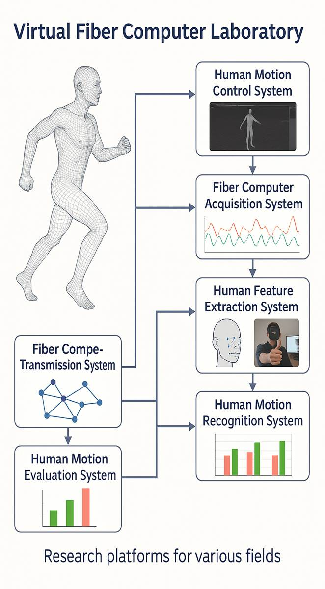
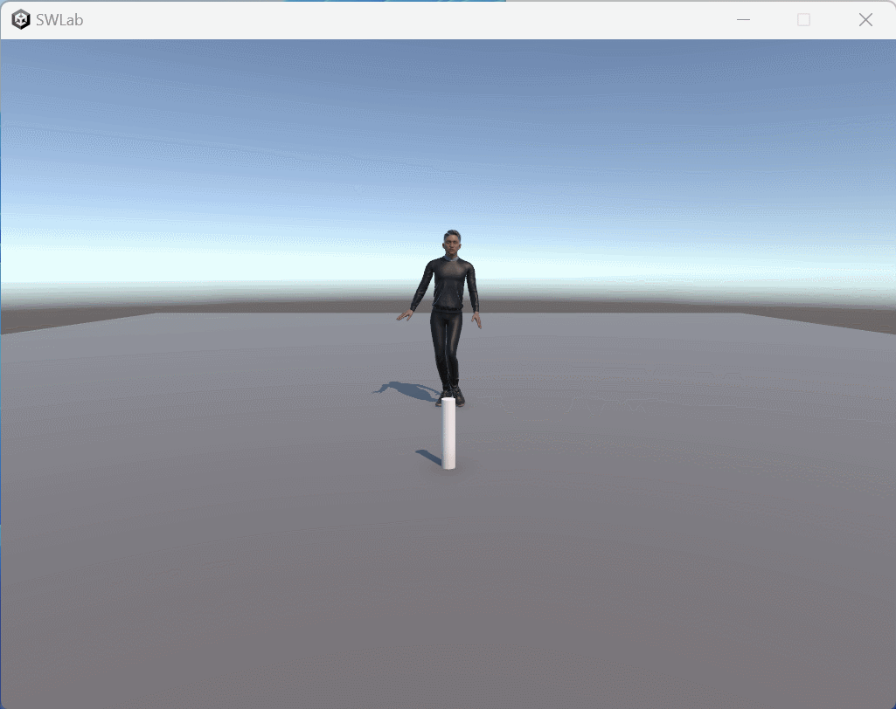
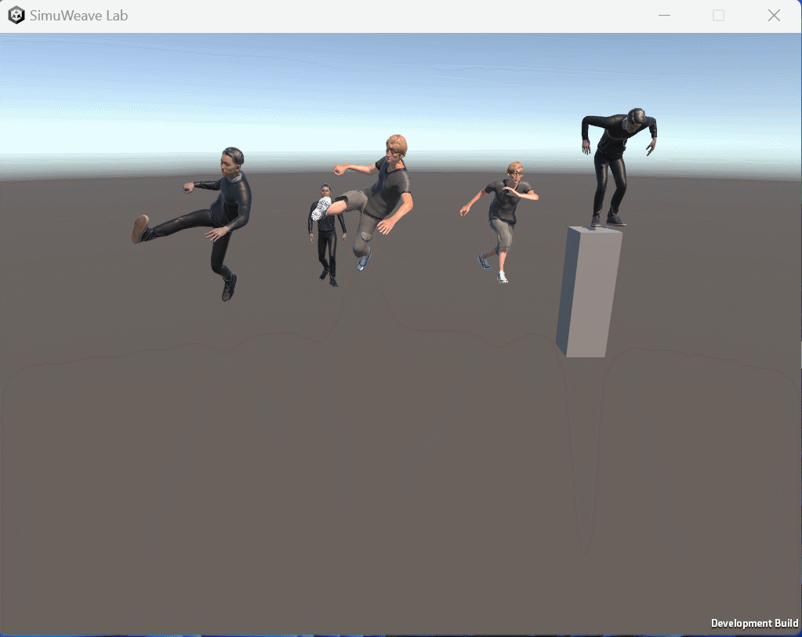
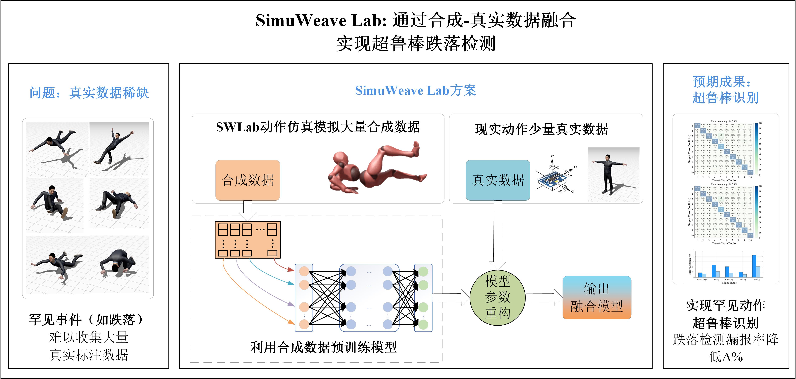

# SimuWeave Lab
SimuWeave Lab—an advanced body-mounted computing platform dedicated to solving data bottlenecks and experimental barriers and bridging the gap between cutting-edge fiber technology and practical applications.

## Mission Statement

SimuWeave Lab is committed to pioneering the future of fiber-based computing through simulation-driven innovation. By developing advanced digital models of flexible computing systems, we aim to bridge the gap between experimental fiber technologies and real-world intelligent applications. Our research integrates material science, computational modeling, machine learning, and flexible electronics to create high-fidelity virtual prototypes that accelerate innovation, reduce development costs, and enable the emergence of smarter, more resilient fiber computing systems.

## Vision

To establish SimuWeave Lab as a global leader in simulation and prototyping of fiber computing technologies, driving transformative advances in intelligent textiles, wearable computing, and soft robotics for the benefit of society.

## 用法：
- 打开main文件夹
- 运行SimuWeave Lab.exe
- 点击记录按钮完成对动作的记录
- 打开CSV文件对数据进行分析

## SimuWeaveLab整体框架
SWLab将运动控制系统、采集系统、传输系统、终端系统、运动特征提取系统、动作识别系统与评估系统有机地结合在一起，运用高精度仿真技术，模拟纤维计算机在真实应用场景中的多物理场行为、数据生成模式以及与算法的交互过程，为下一代纺织品智能体载计算系统的发展注入新动力。

研究框架图

## SimuWeaveLab运行示意图

人物走路摔倒模拟

多个人物执行动作

## SimuWeaveLab application

### 通过合成-真实数据融合实现罕见动作超鲁棒检测
SWLab首先利用高精度动作仿真技术生成大规模、多样化的合成数据集，用于预训练姿态识别模型；随后，结合少量真实标注数据对模型参数进行重构与优化，输出具有超鲁棒性的融合模型。该方法旨在显著提升对跌落等罕见动作的识别精度与鲁棒性，并有效降低漏报率。

